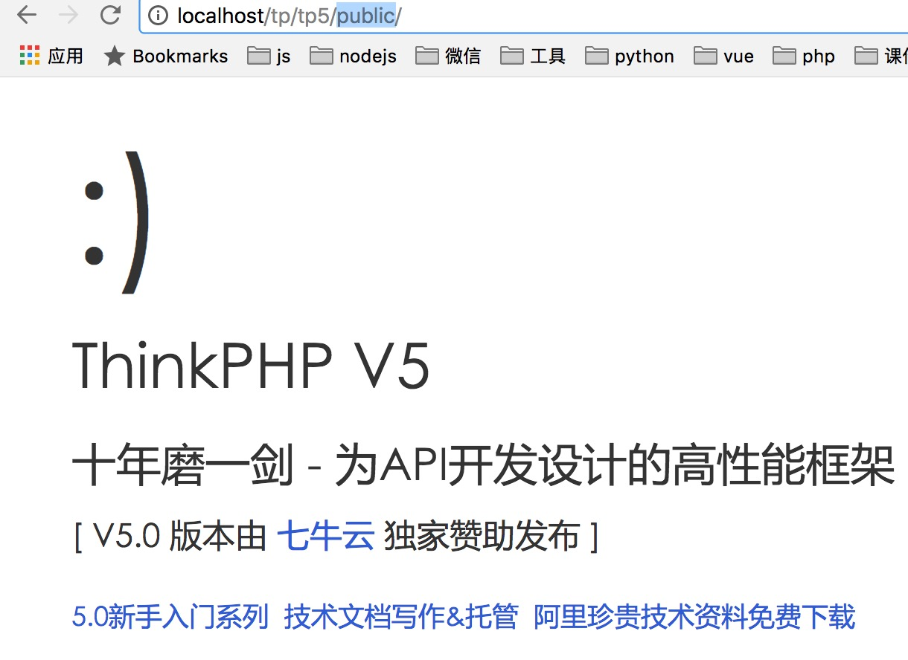
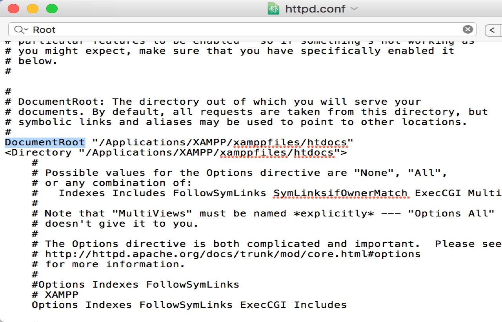

# thinkphp5

`ThinkPHP`是一个免费开源的、快速简单的、面向对象的、轻量级php开发框架

创立于2006年，遵循Apache2开源协议发布

是目前国内最领先和最具影响力的WEB应用开发框架

[文档地址](https://www.kancloud.cn/manual/thinkphp5/118004)

[官网地址](http://www.thinkphp.cn/)

## 为什么选择ThinkPHP5

`ThinkPHP5`采用了全新的架构思想，优化了核心，是一个颠覆性的版本。

支持composer方式安装(类似于nodejs中npm)，对API进行了大量的优化更符合了现代web开发的方式

不兼容之前的版本

ThinkPHP5是上海的一家公司在进行维护,所以稳定性和更新都可以得到保障,更新的速度也很快

##安装composer

我是mac系统,所以就以mac为例;

按照官网的说法，使用`curl -sS https://getcomposer.org/installer | php`和`php -r "readfile('https://getcomposer.org/installer');" | php`都出现了错误。所以使用的是：

**STEP1**、在官网的下载页面[**https://getcomposer.org/download/**

下载到电脑后，为了可以在终端直接使用composer命令

**STEP2**、打开终端,**cd到下载的composer.phar所在的文件夹下**，执行

```
sudo mv composer.phar /usr/local/bin/composer
```

嗯，用上管理员权限吧，然后在终端敲入composer的时候，应该会出现

```
-bash: /usr/local/bin/composer: Permission denied
```

的情况，那么就给他设置下权限

```
chmod +x /usr/local/bin/composer
```

再敲入composer

windows的安装：[安装composer](https://www.kancloud.cn/manual/thinkphp5/118006)

## 安装ThinkPHP

###使用git的方式安装

环境要求:

```
php>5.4

mysql>5.5
```

ThinkPHP5.0拆分为多个仓库，主要包括：

-   应用项目：https://github.com/top-think/think
-   核心框架：https://github.com/top-think/framework

>   之所以设计为应用和核心仓库分离，是为了支持Composer单独更新核心框架。

首先克隆应用项目仓库,[地址](https://github.com/top-think/think)

```
git clone https://github.com/top-think/think tp5(项目的名称)
```

然后键入`cd think_git`进入项目目录, 执行以下命令克隆核心框架仓库：

```
git clone https://github.com/top-think/framework thinkphp(框架的名称)
```

两个仓库克隆完成后，就完成了ThinkPHP5.0的Git方式下载，如果需要更新核心框架的时候，只需要切换到thinkphp核心目录下面，然后执行：

```
git pull https://github.com/top-think/framework
```

现在只需要做最后一步来验证是否正常运行。

在浏览器中输入地址：

```
http://localhost/tp5/public/
```

### 使用composer的方式安装

在确认已经安装好`composer`可以使用`composer --version`来查看版本确认是否安装完成.

然后在这里最好通过键入：

```
composer config -g repositories.packagist composer https://packagist.phpcomposer.com
```

切换到国内的镜像，可以加快安装,提高安装成功的几率

然后再在需要安装`ThinkPHP`的目录下执行:

```
composer create-project topthink/think=5.0.* tp5  --prefer-dist
```

来进行安装,`topthink/think=5.0.*`这句代码中的`think=5.0.*`表示安装5.0版本,不要忽略这行代码，不加默认安装最新版，而最新版是有问题的(本机亲测).`tp5`表示的是创建的项目名称,当然是可以修改为你需要的名称

然后在浏览器中访问这个目录下的`public`,如果出现:




说明就安装成功了

### 官网下载安装

也可以直接去[官网下载](http://www.thinkphp.cn/),选择完整版下载就可以，另外官网提供的版本并不是最新版，而是稳定版本.

当然也可以去`thinkphp`的[`github`](https://github.com/top-think/think)下载

### 更改document root

有的同学不太喜欢`apache`默认指向的`htdocs`目录，如果想要更改，可以通过更改`httpd.conf`文件的`DocumentRoot`选项来设置你想要的地址



##ThinkPHP5目录介绍

下载最新版框架后，解压缩到web目录下面，可以看到初始的目录结构如下：

```
project  应用部署目录
├─application           应用目录（可设置）
│  ├─common             公共模块目录（可更改）
│  ├─index              模块目录(可更改)
│  │  ├─config.php      模块配置文件
│  │  ├─common.php      模块函数文件
│  │  ├─controller      控制器目录
│  │  ├─model           模型目录
│  │  ├─view            视图目录
│  │  └─ ...            更多类库目录
│  ├─command.php        命令行工具配置文件
│  ├─common.php         应用公共（函数）文件
│  ├─config.php         应用（公共）配置文件
│  ├─database.php       数据库配置文件
│  ├─tags.php           应用行为扩展定义文件
│  └─route.php          路由配置文件
├─extend                扩展类库目录（可定义）
├─public                WEB 部署目录（对外访问目录）
│  ├─static             静态资源存放目录(css,js,image)
│  ├─index.php          应用入口文件
│  ├─router.php         快速测试文件
│  └─.htaccess          用于 apache 的重写
├─runtime               应用的运行时目录（可写，可设置）
├─vendor                第三方类库目录（Composer）
├─thinkphp              框架系统目录
│  ├─lang               语言包目录
│  ├─library            框架核心类库目录
│  │  ├─think           Think 类库包目录
│  │  └─traits          系统 Traits 目录
│  ├─tpl                系统模板目录
│  ├─.htaccess          用于 apache 的重写
│  ├─.travis.yml        CI 定义文件
│  ├─base.php           基础定义文件
│  ├─composer.json      composer 定义文件
│  ├─console.php        控制台入口文件
│  ├─convention.php     惯例配置文件
│  ├─helper.php         助手函数文件（可选）
│  ├─LICENSE.txt        授权说明文件
│  ├─phpunit.xml        单元测试配置文件
│  ├─README.md          README 文件
│  └─start.php          框架引导文件
├─build.php             自动生成定义文件（参考）
├─composer.json         composer 定义文件
├─LICENSE.txt           授权说明文件
├─README.md             README 文件
├─think                 命令行入口文件
```

一般在`application`目录下还会创建一个`admin`作为后台的管理模块

在`public`目录下还有`robots.txt`这个是搜索引擎爬虫文件([robots.txt写法](https://jingyan.baidu.com/article/eb9f7b6dab75ca869364e8d2.html))，它主要是给搜索引擎看的，我们可以在这个文件定义一些链接或者url 可以被搜索引擎爬取，那些url不可以被搜索引起爬取.比如后台`admin`的链接是不需要(不希望)被搜索引擎爬取,而前台`index`是需要被搜索引擎爬取的.

在`public`目录下的`router.php`是快速测试文件，在电脑没装`apache`的情况下，只有`php`也可以启动`worker-server`来启动这个框架

在终端中进入`public`这个目录，然后键入：`php -S localhost:8888 router.php`来启动,然后在浏览器键入`localhost:8888`就可以访问了.

`runtime`是网站运行中的缓存文件，它包括日志，缓存和编译文件等等

## 开发规范

### 目录和文件

- 目录使用小写+下划线；
- 类库、函数文件统一以`.php`为后缀；
- 类的文件名均以命名空间定义，并且命名空间的路径和类库文件所在路径一致；
- 类文件采用驼峰法命名（首字母大写），其它文件采用小写+下划线命名；
- 类名和类文件名保持一致，统一采用驼峰法命名（首字母大写）；

### 函数和类、属性命名

- 类的命名采用驼峰法（首字母大写），例如 `User`、`UserType`，默认不需要添加后缀，例如`UserController`应该直接命名为`User`；
- 函数的命名使用小写字母和下划线（小写字母开头）的方式，例如 `get_client_ip`；
- 方法的命名使用驼峰法（首字母小写），例如 `getUserName`；
- 属性的命名使用驼峰法（首字母小写），例如 `tableName`、`instance`；
- 以双下划线“__”打头的函数或方法作为魔术方法，例如 `__call` 和 `__autoload`；

### 常量和配置

- 常量以大写字母和下划线命名，例如 `APP_PATH`和 `THINK_PATH`；
- 配置参数以小写字母和下划线命名，例如 `url_route_on` 和`url_convert`；

### 数据表和字段

- 数据表和字段采用小写加下划线方式命名，并注意字段名不要以下划线开头，例如 `think_user` 表和 `user_name`字段，不建议使用驼峰和中文作为数据表字段命名。

### 应用类库命名空间规范

应用类库的根命名空间统一为app（不建议更改，可以设置`app_namespace`配置参数更改，`V5.0.8`版本开始使用`APP_NAMESPACE`常量定义）；
例如：`app\index\controller\Index`和`app\index\model\User`。

## 调试模式

ThinkPHP有专门为开发过程而设置的调试模式，开启调试模式后，会牺牲一定的执行效率，但带来的方便和除错功能非常值得。

> 我们强烈建议ThinkPHP开发人员在开发阶段始终开启调试模式（直到正式部署后关闭调试模式），方便及时发现隐患问题和分析、解决问题。

应用默认开启调试模式，在完成开发阶段部署到生产环境后，可以修改应用配置文件的`app_debug`参数关闭调试模式切换到部署模式。

```php
// 关闭调试模式
'app_debug' => false,
```

文件路径:`application/config.php`