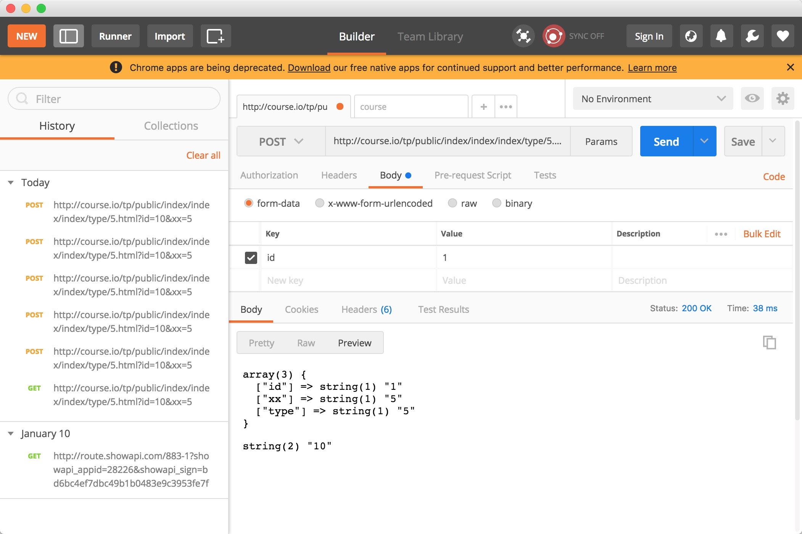
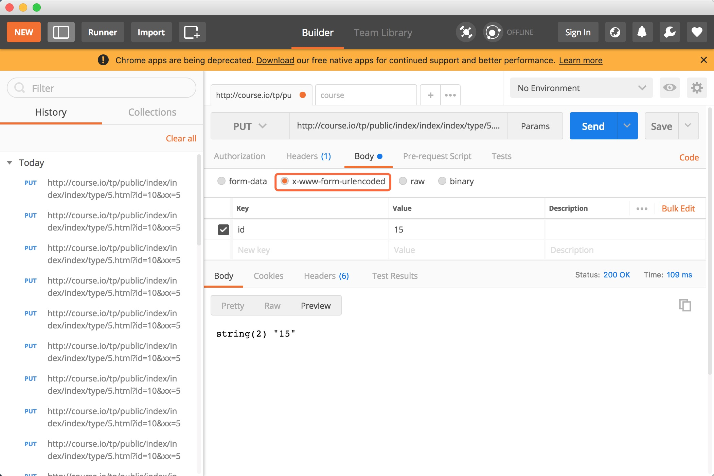

# 请求对象Request

在开始前先将`application`中的所有文件删除.

然后在`index`模块中获取`request`对象：

```php
<?php 

namespace app\index\controller;
class Index
{
  public function index()
  {
    $request = request();
    dump($request);
    return "index";
  }
}
```

我们也可以通过`Request`类：

```php
<?php 

namespace app\index\controller;

use think\Request;
class Index
{
  public function index()
  {
    // $request = request();
    // Request是单例模式，所以必须通过instance来进行访问.
    $request = Request::instance();
    dump($request);
    // return "index";
  }
}
```

第三种写法(推荐写法):

```php
<?php 

namespace app\index\controller;

use think\Request;
class Index
{
  public function index(Request $request)
  {
    // $request = request();
    // Request是单例模式，所以必须通过instance来进行访问.
    // $request = Request::instance();
    dump($request);
    // return "index";
  }
}
```

## 请求参数

我们为了模拟一个真实的环境，首先更改一下本地的`hosts`,以`mac`为例，按快捷键组合 `Shift+Command+G `三个组合按键，并输入 `Hosts` 文件的所在路径：`/etc/hosts`.然后更改添加一行代码：

```
127.0.0.1 course.io
```

设置可以使用`course.io`进行访问，比如访问路径为:`http://course.io/tp/public/index/index/index/type/5.html?id=10`

路径后面的`.html`是为了防止别人知道我们是使用什么后台语言开发的.

```php
<?php 

namespace app\index\controller;

use think\Request;
class Index
{
  public function index(Request $request)
  {
    // 获取浏览器输入框的值
    // 域名
    dump($request -> domain());
    // 获取路径部分
    dump($request -> pathinfo());
    // 获取真实的路径部分(不含后缀)
    dump($request -> path());
    // 获取类型
    dump($request -> method());
    // 判断请求类型是否为get
    dump($request -> isGet());
    // 判断是否通过ajax请求
    dump($request -> isAjax());

    // 获取请求的参数(只有query)
    dump($request -> get());
    // 获取请求的参数(包含param参数)
    dump($request -> param());
    // 获取post请求的参数
    dump($request -> post());
    // 获取session的值
    // session('name', 'tangcaiye');
    dump($request -> session());
    // 获取cookie的值
    cookie('email', '641418330@qq.com');
    dump($request -> cookie());
    // 获取某一个参数的值
    dump($request -> param('type'));
    // 获取模块
    dump($request -> module());
    // 获取控制器
    dump($request -> controller());
    // 获取当前操作名
    dump($request -> action());
  }
}
```

获取详见[文档](https://www.kancloud.cn/manual/thinkphp5/158834),或者可以通过查看源码: `thinkphp/library/think/Request.php`

## input助手函数

### postman的安装使用

通过`$request -> param()`获取的参数中也包含了通过post方式发送的数据，如果要模拟发送`post`请求，我们可以使用一个叫`postman`的工具.科学上网后在谷歌应用商店搜索`postman`然后安装就可以了.

然后选择`post`发送请求：



```php
<?php 

namespace app\index\controller;

use think\Request;
class Index
{
  public function index(Request $request)
  {
    // 这个获取的参数中也包含了通过post方式发送的数据
    dump($request -> param());
    // 当post中路径和body都传递了id参数,它会选择post的id
    $res = input('id');
    dump($res);
  }
}
```

当请求体和路径中都包含同样参数的时候默认是会选择`post`中请求体的参数

如果想要获取`get`中的参数可以使用：

```php
// 当post和get中都传递了id参数,它会选择post的id
$res = input('get.id');
dump($request -> get('id'));
dump($res);
```

当然获取`post`中的参数就是:

```php
$res = input('post.id');
```

如果想在没有这个参数的时候，设置默认值：

```php
$res = input('post.sid', 100);
dump($request -> post('sid', 100));
```

默认获取的值的类型是字符串类型,比如我们在`postman`中发送一个请求体`sid`，值为`10`输出的结果.

```php
string(2) "10"
string(2) "10"
```

如果希望在输出的更改类型，可以通过设置第三个参数为`intval`

```php
$res = input('post.sid', 100, 'intval');
dump($request -> post('sid', 100));
dump($res);
```

然后将`postman`中请求体`sid`的值为`abc`,然后输出的结果：

```
string(3) "abc"
string(1) "0"
```

`input`中除了`post`以外，还可以获取`param`、`session`、`put`的值,比如我们先添加一个`seesion`：

```php
session('email', '641418330@qq.com');
```

在运行后，再次键入:

```php
dump(input('session.email'));//return string(16) "641418330@qq.com"
```

如果想对获取的`seesion`内容设置默认值,同样也可以通过:

```php
dump(input('session.name', 'tangcaiye')); //string(9) "tangcaiye"
```

### put请求

除了可以获取`session`以外，也支持获取`put`的值.我们还是通过`postman`来进行模拟.获取代码：

```php
dump(input('put.id'));
```

这个地方需要注意，在发送请求的时候需要将请求的`Content-Type`设置为`x-www-form-urlencoded`.因为`fromdata`不支持`put`



`input`能支持的所有请求方式，可以查看`thinkphp/helper.php`的`input`函数(第130行):

```php
['get', 'post', 'put', 'patch', 'delete', 'route', 'param', 'request', 'session', 'cookie', 'server', 'env', 'path', 'file']
```

