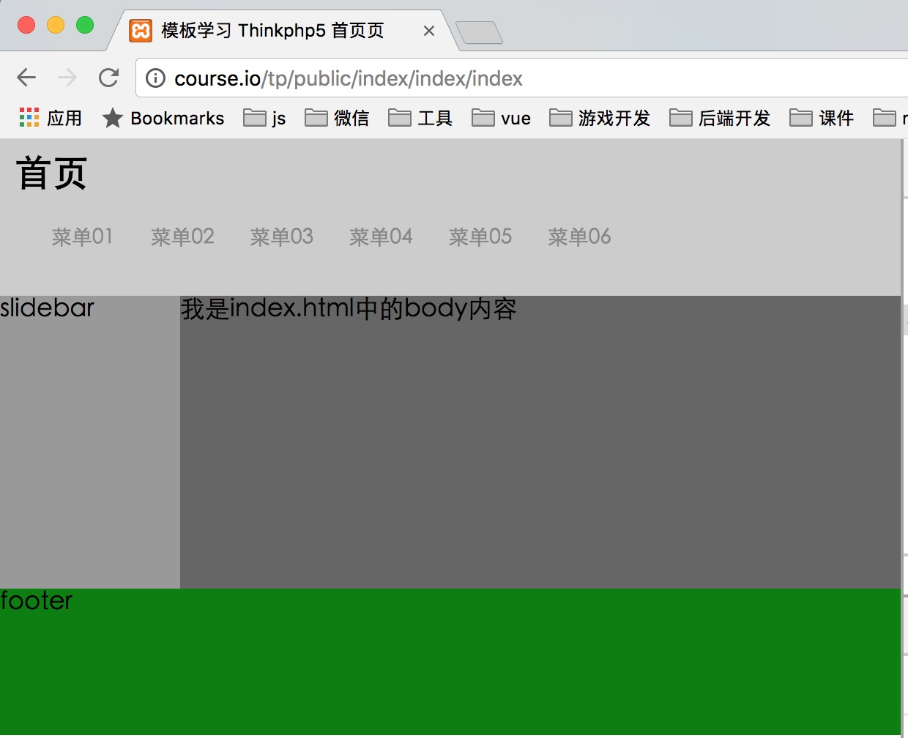

# 8-视图和模板

前面我们学习的响应配置,返回的都是数据，那如果我希望访问的路径能返回一个页面呢,这个时候就会用到`thinkphp`中的视图模板.

首先我们可以在`index`模块中的`index`函数中输出一个`view`助手函数(它是用来输出一个`view`页面的)

```php
<?php 
namespace app\index\controller;

class Index
{
  
  public function index()
  {
    // 默认模板的地址：
    // application/index/view/index(控制器名称)/index.html(对应函数名称)
    return view();
  }
}
```

如果你直接输出应该是没有结果的,因为默认会去你模块下的`view`目录下去查找跟你控制器和函数同名的文件.比如我们现在是`application/app/index/controller/Index.php`下的`index`函数，那么它就会查找`application/index/view/index(控制器名称)/index.html(对应函数名称)`

我们可以创建一个`application/index/view/index/index.html`:

```html
<!DOCTYPE html>
<html lang="en">
<head>
  <meta charset="UTF-8">
  <title>Document</title>
</head>
<body>
  <h1>这里是index.html</h1>
</body>
</html>
```

然后再次运行就可以了.

然后`view`助手函数是还可以接收参数的，接收的参数就是你要访问的`view`页面文件名.也可以理解为是用来修改模板文件目录的,比如:

```php
return view('upload');
```

这个访问的就是`view/upload.html`.

也可以更改为其他路径,比如:

```php
return view('public/upload');
```

这个访问的路径就是`view/public/upload.html`

如果你的路径是:

```php
return view('./index.html');
```

访问的就是`public`目录下的`index.html`,注意如果你直接访问`public`目录默认访问的也是`index.html`

## 视图传参

如果希望给视图传递参数，可以通过：

```php
return view('index', [
        'email' => '641418330@qq.com'
      ]);
```

这里是访问`view`下的`index.html`并且传递了一个参数为`email`

然后在`index.html`页面中可以通过:

```html
<!DOCTYPE html>
<html lang="en">
<head>
  <meta charset="UTF-8">
  <title>Document</title>
</head>
<body>
  <h1>这里是view/index目录下的index.html</h1>
  <p>{$email}</p>
</body>
</html>
```

`{$email}`它就是用来获取传递的`email`值的.

## Controller类方法

也可以使用`Controller`类来实现：

```php
<?php 
namespace app\index\controller;

use think\Controller;
class Index extends Controller
{
  
  public function index()
  {
    // 通过assign也可以传递变量
    $this->assign('assign', '我是assign的xs值');
    return $this->fetch('index', [
      'email'   =>  '641418330@qq.com',
      'user'    =>  'tangcaiye'
    ]);
  }
}
```

```html
<!DOCTYPE html>
<html lang="en">
<head>
  <meta charset="UTF-8">
  <title>Document</title>
</head>
<body>
  <h1>这里是view/index目录下的index.html</h1>
  <p>{$email}</p>
  <p>{$user}</p>
  <p>{$assign}</p>
</body>
</html>
```

但是如果项目中使用了`vue`或者`angluar`，比如`vue`中我们也是可以使用`{}`这种写法去绑定一个对象的.这样就会跟`thinkphp`发生冲突.解决办法我们可以通过修改`thinkphp`的模板配置:

```php
'template'               => [
        // 模板引擎类型 支持 php think 支持扩展
        'type'         => 'Think',
        // 视图基础目录，配置目录为所有模块的视图起始目录
        'view_base'    => '',
        // 当前模板的视图目录 留空为自动获取
        'view_path'    => '',
        // 模板后缀
        'view_suffix'  => 'html',
        // 模板文件名分隔符
        'view_depr'    => DS,
        // 模板引擎普通标签开始标记
        'tpl_begin'    => '{',
        // 模板引擎普通标签结束标记
        'tpl_end'      => '}',
        // 标签库标签开始标记
        'taglib_begin' => '{',
        // 标签库标签结束标记
        'taglib_end'   => '}',
    ]
```

关键的就是`模板引擎普通标签开始标记`和`模板引擎普通标签结束标记`,比如改为：

```php
// 模板引擎普通标签开始标记
'tpl_begin'    => '',
```

这样在页面绑定的时候就可以通过:

```html
<!DOCTYPE html>
<html lang="en">
<head>
  <meta charset="UTF-8">
  <title>Document</title>
</head>
<body>
  <h1>这里是view/index目录下的index.html</h1>
  <p></p>
</body>
</html>
```

``方式进行绑定

还有个更简单的方法,在`{}`的首尾各添加一个括号.`thinkphp`就不会解析了.

```html
<p>{ $email }</p>
```

但是前端框架是能识别的.

除了以上两种，还有：

```php
<?php 
namespace app\index\controller;

use think\Controller;
use think\View;
class Index extends Controller
{
  
  public function index()
  {
    $this->assign('sex', '男');
    // 也可以使用这种写法
    $this->view->user = 'tangcaiye';

    View::share('pass', '12345');
    return $this->fetch('index', [
      'email'   =>  '641418330@qq.com'
    ]);
  }
}
```

## 模板输出替换

支持对视图输出的内容进行字符替换，例如：

```html
<!DOCTYPE html>
<html lang="en">
<head>
  <meta charset="UTF-8">
  <title>Document</title>
  <link rel="stylesheet" href="__CSS__/bootstrap.min.css">
</head>
<body>
  <h1>这里是view/index目录下的index.html</h1>
  <p>__URL__</p>
  <p>__STATIC__</p>
  <p>__JS__</p>
  <p>__CSS__</p>
  <p>__ROOT__</p>
  <button class="btn btn-default">按妞</button>
</body>
</html>
```

也可以新增和修改：

```php
'view_replace_str' => [
  '__123__'   => '一二三四',
]
```

## 模板中使用系统变量 原生标签

 在模板中使用系统的变量：

```html
<!DOCTYPE html>
<html lang="en">
<head>
  <meta charset="UTF-8">
  <title>Document</title>
</head>
<body>
  <h1>这里是view/index目录下的index.html</h1>
  <!-- 获取HOST名 -->
  <p>{$Think.server.HTTP_HOST}</p>
  x
  <!-- 获取环境变量php_app_status -->
  <p>{$Think.env.php_app_status}</p>
  <!-- 获取session下的email -->
  <p>{$Think.session.email}</p>
  <!-- 获取cookie中的name -->
  <p>{$Think.cookie.name}</p>
  <!-- 获取get请求参数中的id -->
  <p>{$Think.get.id}</p>
  <!-- 获取请求参数中的id -->
  <p>{$Think.request.id}</p>
  <!-- 获取post请求中的id -->
  <p>{$Think.post.id}</p>
  <!-- 获取应用所在常量 -->
  <p>{$Think.const.APP_PATH}</p>
  <!-- 也可以直接写常量名，结果是一样的 -->
  <p>{$Think.APP_PATH}</p>
</body>
</html>
```

我们也可以在模板中直接使用原生标签：

```php
<!DOCTYPE html>
<html lang="en">
<head>
  <meta charset="UTF-8">
  <title>Document</title>
</head>
<body>
  <h1>这里是view/index目录下的index.html</h1>
  <?php

    echo APP_PATH;
    $a = 10;
    $b = 20;
    if ($a > $b) {
      echo "1";
    } else {
      echo "2";
    }
  ?>
</body>
</html>
```

当然，不建议在模板编写逻辑，逻辑应该是放在控制器中的.

## 模板变量

我们也可以在模板中之间调用`php`中的函数,`index`模块内容:

```php
<?php 
namespace app\index\controller;

use think\Controller;
use think\View;
class Index extends Controller
{
  
  public function index()
  {
    $this->assign('email', '641418330@qq.com');
    $this->assign('time', time());
    $this->assign('user', 'tangcaiye');
    return $this->fetch();
  }
}
```

`index`模板内容

```php
<!DOCTYPE html>
<html lang="en">
<head>
  <meta charset="UTF-8">
  <title>Document</title>
</head>
<body>
  <h1>这里是view/index目录下的index.html</h1>
  <h2>{$email} : {$email | md5}</h2>
  <!-- substr($obj, 0, 3) -->
  <h2>{$email} : {$email | substr=0,8}</h2>
  <!-- date("Y-m-d", time()) -->
  <!-- ###为占位符，表示$time变量本身 -->
  <h2>{$time} : {$time|date="Y-m-d", ###}</h2>
  <h2>{$email} : {$email | substr=###, 0, 8}</h2>
  <!-- 调用多个函数 -->
  <h2>{$email} : {$email | md5} : {$email | md5 | strtoupper}</h2>
</body>
</html>
```

当然如果函数的参数第一个就是变量本身是可以忽略不写的

我们也可以在`{}`中进行一些简单的运算(`+,-,*,/,%,++,--,三元运算`),比如我们在`index`模块中定义了两个变量:

```php
$this->assign('a',10);
$this->assign('b',20);
```

然后在模板中调用的时候：

```html
<p>a+b = {$a+$b}</p>
```

如果想直接输出某个变量(原样输出)

```php
<!-- 如果希望输出{$email} -->
{literal}
  {$email}
{/literal}
```

页面输出的就是`{$email}`

如果你想某个注释不显示在源码中,可以使用`thinkphp`的注释:

```php
{/* tp中的注释 */}
```

## 模板中的循环标签

首先定义一些模拟的数据：

```php
<?php 
namespace app\index\controller;

use think\Controller;
use think\View;
class Index extends Controller
{
  
  public function index()
  {
    $list = [
      'user1' => [
        'name'  => 'tangxiangrong',
        'email' => 'tangxiangrong@qq.com'
      ],
      'user2' => [
        'name'  => 'tangcaiye',
        'email' => '641418330@qq.com'
      ],
      'user3' => [
        'name'  => 'demo',
        'email' => 'demo@qq.com'
      ]
    ];

    $this->assign('list', $list);

    return $this->fetch();
  }
}
```

###volist

然后`view`中的编写循环的标签[`volist`](https://www.kancloud.cn/manual/thinkphp5/125017)：

```html
<!DOCTYPE html>
<html lang="en">
<head>
  <meta charset="UTF-8">
  <title>Document</title>
</head>
<body>
  <h1>这里是view/index目录下的index.html</h1>
  <!-- volist，item是我自定的变量名,可以更改 -->
  <!-- offset为开始的位置 -->
  <!-- length为循环的次数 -->
  {volist name="list" id="item" offset="1" length="1"}
    <p>{$item.name}</p>
  {/volist}
</body>
</html>
```

输出偶数记录：

```html
<!DOCTYPE html>
<html lang="en">
<head>
  <meta charset="UTF-8">
  <title>Document</title>
</head>
<body>
  <h1>这里是view/index目录下的index.html</h1>
  
  <!-- mod取余，mod="2"意思就是循环的下标跟2进行取余 -->
  <!-- empty如果没有数据 -->
  {volist name="list" id="item" mod="2" empty="暂时没有数据"}
    <!-- i是下标,可以使用属性key修改 -->
    <!-- mod是取余的值 -->
    <p>下标是：{$i},取余的值{$mod}</p>
    <!-- 判断如果mod的值为0就输出里面的内容 -->
    {eq name="mod" value="1"}<p>{$item.name}</p>{/eq}
  {/volist}
</body>
</html>
```

### foreach

foreach标签类似与volist标签，只是更加简单，没有太多额外的属性，最简单的用法是：

```
{foreach $list as $vo} 
    {$vo.id}:{$vo.name}
{/foreach}
```

该用法解析后是最简洁的。

也可以使用下面的用法：

```
{foreach name="list" item="vo"}
    {$vo.id}:{$vo.name}
{/foreach}
```

name表示数据源 item表示循环变量。

可以输出索引，注意，这里的key是键名不是下标，如下：

```
{foreach name="list" item="vo" }
    {$key}|{$vo}
{/foreach}

```

也可以定义索引的变量名

```
{foreach name="list" item="vo" key="k" }
   {$k}|{$vo}
{/foreach}
```

### for

用法：

```php
{for start="开始值" end="结束值" step="步进值" name="循环变量名" }
{/for}
```

实例：

```php
{for start="1" end="10" step="2" name="k"}
	<p>{$k}</p>
{/for}
```

## 比较标签

比较标签用于简单的变量比较，复杂的判断条件可以用if标签替换，比较标签是一组标签的集合，基本上用法都一致，如下：

```
{比较标签 name="变量" value="值"}
内容
{/比较标签}

```

系统支持的比较标签以及所表示的含义分别是：

| 标签             | 含义   |
| -------------- | ---- |
| eq或者 equal     | 等于   |
| neq 或者notequal | 不等于  |
| gt             | 大于   |
| egt            | 大于等于 |
| lt             | 小于   |
| elt            | 小于等于 |

他们的用法基本是一致的，区别在于判断的条件不同，并且所有的比较标签都可以和else标签一起使用。

声明变量a为10

```php
$this->assign('a', 10);
$this->assign('b', 20);
```

```html
<!DOCTYPE html>
<html lang="en">
<head>
  <meta charset="UTF-8">
  <title>Document</title>
</head>
<body>
  <h1>这里是view/index目录下的index.html</h1>
  
  <!-- eq:相等 -->
  {eq name="a" value="10"}
    <p>相等</p>
  {else/}
    <p>不相等</p>
  {/eq}
  <!-- neq:不相等 -->
  {neq name="a" value="10"}
    <p>不相等</p>
  {else/}
    <p>相等</p>
  {/neq}
  <!-- gt:大于 -->
  {gt name="a" value="3"}
    <p>大于</p>
  {else/}
    <p>小于</p>
  {/gt}
  <!-- egt:大于等于变量b -->
  {egt name="a" value="$b"}
    <p>大于等于</p>
  {else/}
    <p>小于</p>
  {/egt}
</body>
</html>
```

## 条件判断标签

### switch

用法：

```php
{switch name="变量" }
    {case value="值1" break="0或1"}输出内容1{/case}
    {case value="值2"}输出内容2{/case}
    {default /}默认情况
{/switch}
```

例子：

```php
<!DOCTYPE html>
<html lang="en">
<head>
  <meta charset="UTF-8">
  <title>Document</title>
</head>
<body>
  <h1>这里是view/index目录下的index.html</h1>
  
  <!-- switch -->
  {switch name="Think.get.level"}
    {case value="1"} <p>普通会员</p> {/case}
    {case value="2"} <p>铜牌会员</p> {/case}
    {case value="3"} <p>白银会员</p> {/case}
    {case value="4"} <p>黄金会员</p> {/case}
	{default /} 游客
  {/switch}
</body>
</html>
```

同时也可以变量后面也可以跟函数,比如取绝对值的函数`abs`

```php
{switch name="Think.get.level|abs"}
```

对于case的value属性可以支持多个条件的判断，使用”|”进行分割，例如:

```php	
{switch name="Think.get.type"}
    {case value="gif|png|jpg"}图像格式{/case}
    {default /}其他格式
{/switch}
```

表示如果$_GET["type"] 是gif、png或者jpg的话，就判断为图像格式。

### range

也可以通过`range`这个标签：

```php
{range name="Think.get.level" value="1,2,3" type="in"}
    <p>是1，2，3</p>
  {else/}
    <p>不是1，2，3</p>
{/range}
```

`type`为`in`意思就是用`Think.get.level`的值跟`value`的值进行比较，如果在里面的话就执行`<p>是1，2，3</p>`如果不在的话就执行`<p>不是1，2，3</p>`

`type`的还有`notin(不在某个范围内)`、`between(判断变量是否在某个区间范围内)`、`notbetween(来判断变量不在某个范围内)`

同时你也可以直接使用`in`、`notin`、`between`、`notbetween`：

```php
  {in name="Think.get.level" value="1,2,3"}
    <p>是1,2,3</p>
  {else/}
    <p>不是1,2,3</p>
  {/in}
```

## 包含和继承

### 包含

在当前模版文件中包含其他的模版文件使用include标签，标签用法：

```
{include file='模版文件1,模版文件2,...' /}

```

> 包含的模板文件中不能再使用模板布局或者模板继承。

比如我们的有两个模板页的导航部分都是一样的,这个时候我们就可以将导航抽出来单独放到一个文件中.比如新建了一个`application/index/view/common/nav.html`:

```html
<ul class="nav">
  <li><a href="###">菜单01</a></li>
  <li><a href="###">菜单02</a></li>
  <li><a href="###">菜单03</a></li>
  <li><a href="###">菜单04</a></li>
  <li><a href="###">菜单05</a></li>
  <li><a href="###">菜单06</a></li>
</ul>
```

然后在在需要用到导航的页面中引入:

```php
<!DOCTYPE html>
<html lang="en">
<head>
  <meta charset="UTF-8">
  <title>page1</title>
  <link rel="stylesheet" href="__CSS__/style.css">
</head>
<body>
  <div class="wrap">
    <!-- 头部 -->
    <div class="header">
      <!-- 不需要编写.html,默认查找的就是view目录下的文件 -->
      {include file="common/nav"/}
    </div>
    <!-- 主体部分 -->
    <div class="main">
      <!-- 边栏 -->
      <div class="slidebar">
        slidebar
      </div>
      <!-- 内容 -->
      <div class="body">
        body
      </div>
    </div>
    <!-- 尾部 -->
    <div class="footer">
      footer
    </div>
  </div>
</body>
</html>
```

在包含页面的时候我们还可以进行传参

比如我们在`index`模块中定义了:

```php
<?php 
namespace app\index\controller;

use think\Controller;
use think\View;
class Index extends Controller
{
  
  public function index()
  {
    $this->assign('title', "首页");
    return $this->fetch();
  }
  public function page1()
  {
    $this->assign('title', "page1页面");
    // 默认查找view中的page.html
    return $this->fetch();
  }
}
```

然后更改包含`nav.html`的代码

```php
{include file="common/nav" title="$title"/}
```

修改`nav.html`的代码

```html
<h2>[title]</h2>
<ul class="nav">
  <li><a href="###">菜单01</a></li>
  <li><a href="###">菜单02</a></li>
  <li><a href="###">菜单03</a></li>
  <li><a href="###">菜单04</a></li>
  <li><a href="###">菜单05</a></li>
  <li><a href="###">菜单06</a></li>
</ul>
```

### 继承

模板继承是一项更加灵活的模板布局方式,提高页面的重用性.

比如我们每个页面中都会有头部、主体、底部，我们可以将这个页面专门放到一个页面，比如叫`base.html`中,然后通过`extend`进行继承引入:

```php
{extend name="common/base" /}
```

比如，现在有`index`、`page1`、`page2`引入了`base.html`但是每个页面的内容还是有些不一样，这个时候就使用`block`，在`base`页进行挖坑

```html
<!DOCTYPE html>
<html lang="en">
<head>
  <meta charset="UTF-8">
  <title>
    {block name="title"}
      模板学习 Thinkphp5 index页
    {/block}
  </title>
  <link rel="stylesheet" href="__CSS__/style.css">
</head>
<body>
  <div class="wrap">
    <!-- 头部 -->
    <div class="header">
      {include file="common/nav" title="$title"/}
    </div>
    <!-- 主体部分 -->
    <div class="main">
      <!-- 边栏 -->
      <div class="slidebar">
        slidebar
      </div>
      <!-- 内容 -->
      <div class="body">
        {block name="body"}
        {/block}
      </div>
    </div>
    <!-- 尾部 -->
    <div class="footer">
      footer
    </div>
  </div>
</body>
</html>
```

然后在调用的继承`base`的时候：

```php
{extend name="common/base" /}
{block name="title"}
  模板学习 Thinkphp5 page2
{/block}
{block name="body"}
  <h2>我是page2下的body内容</h2>
{/block}
```

有时候我们可能需要说继承挖坑位置(`base`页面中的`block`)的内容,比如在`base`中新挖了一个坑

```html
<!-- 尾部 -->
<div class="footer">
  {block name="footer"}
  footer
  {/block}
</div>
```

然后在填坑的时候(调用)的时候想要内部默认的`footer`，我们可以这么写:

```php
{block name="footer"}
  page1_{__block__}
{/block}
```

`{__block__}`也就是默认的`footer`

### 模板布局(layout)

如果页面内容相似度很高，只是部分内容内容会变化，可以使用`layout`模板布局

你仅需在项目配置文件中添加相关的布局模板配置，就可以简单实现模板布局功能，比较适用于全站使用相同布局的情况，需要配置开启layout_on 参数（默认不开启），并且设置布局入口文件名layout_name（默认为layout）。

```php
'template'  =>  [
    'layout_on'     =>  true,
    'layout_name'   =>  'layout',
]
```

开启`layout_on`后，我们的模板渲染流程就有所变化，例如：

```php
<?php 
namespace app\index\controller;

use think\Controller;
use think\View;
class Index extends Controller
{
  
  public function index()
  {
    $this->assign('title', "首页");
    return $this->fetch();
  }
}
```

在不开启`layout_on`布局模板之前，会直接渲染 `application/index/view/index/index.html` 模板文件,开启之后，首先会渲染`application/index/view/layout.html` 模板，布局模板的写法和其他模板的写法类似，本身也可以支持所有的模板标签以及包含文件，区别在于有一个特定的输出替换变量`{__CONTENT__}`，例如，下面是一个典型的layout.html模板的写法：

```html
{include file="public/header" /}
 {__CONTENT__}
{include file="public/footer" /}
```

实例：

```html
<!DOCTYPE html>
<html lang="en">
<head>
  <meta charset="UTF-8">
  <title>
      模板学习 Thinkphp5 {$title}页
  </title>
  <link rel="stylesheet" href="__CSS__/style.css">
</head>
<body>
  <div class="wrap">
    <!-- 头部 -->
    <div class="header">
      {include file="common/nav" title="$title"/}
    </div>
    <!-- 主体部分 -->
    <div class="main">
      <!-- 边栏 -->
      <div class="slidebar">
        slidebar
      </div>
      <!-- 内容 -->
      <div class="body">
        {__CONTENT__}
      </div>
    </div>
    <!-- 尾部 -->
    <div class="footer">
        footer
    </div>
  </div>
</body>
</html>
```

而我们在编写模板`index.html`的时候,只需要写放在`body`中的内容，我们我们在`index.html`中：

```html
我是index.html中的body内容
```

最终显示效果:

